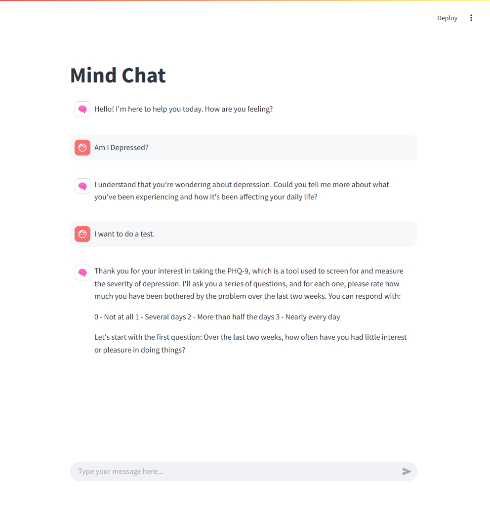

# Psychology Counseling AI Agent

## Overview
MindIO is an AI-powered mental health counseling system designed to provide empathetic support through interactive dialogues. The system leverages advanced language models to deliver personalized responses, psychological testing, coping strategies, and mental health resources tailored to each user's needs.



## Key Features
- **Adaptive Conversation Flow**: Automatically transitions between different counseling stages based on user responses
- **Knowledge-Enhanced Responses**: Integrates external knowledge bases to provide accurate information on mental health topics
- **Psychological Testing**: Offers standardized assessments for anxiety, depression, and stress with personalized feedback
- **Multi-Provider Support**: Compatible with various AI providers including OpenAI, DeepSeek, Qwen, SilicoFlow, and Ollama
- **Streamlined Chat Interface**: Clean, user-friendly interface focused on the counseling experience

## Project Structure
The project is organized into several modules, each responsible for specific functionalities:

### Contains the main application code.
- **agents/**: Implements various agent types for handling user interactions.
- **history/**: Save and Load conversations records.
- **prompts/**: Contains system prompts and templates for guiding conversations.
- **tools/**: Includes utility functions for emotional analysis.

## Installation
1. Clone the repository:
   ```
   git clone https://github.com/rendao/mindio.git
   ```
2. Navigate to the project directory:
   ```
   cd mindio
   ```
3. Install the required dependencies:
   ```
   pip install -r requirements.txt
   ```

## Usage
There are two ways to start the MindIO application:

### 1. Streamlit Web Interface (Recommended)
To launch the interactive web interface, run:
```
streamlit run run.py
```

### 2. Console Interface
To start the application, run the following command:
```
python console.py
```
Follow the on-screen prompts to interact with the counseling assistant.

#### Command-Line Operations
The console interface supports several commands to manage your conversation history:
```
- **/h**: Display help and list available commands
- **/s**: Save the current conversation to a file in the "history/data" directory
- **/ls**: List all previously saved conversations
- **/l [index]**: Load a conversation by its index number (as shown in /ls)
- **/x**: Exit the application

```

## Contributing
Contributions are welcome! Please submit a pull request or open an issue for any enhancements or bug fixes.


## License
This project is licensed under the MIT License. See the LICENSE file for more details.
